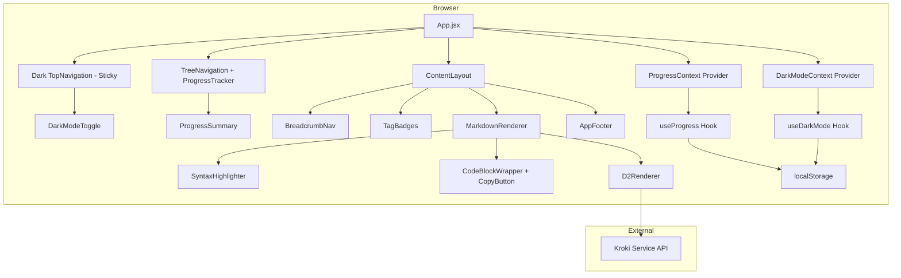

# 설계 문서: Learning App Enhancements

## 개요

이 설계 문서는 Amazon Bedrock AgentCore 학습 앱의 8개 기능 개선 요구사항에 대한 기술 설계를 정의한다. 현재 앱은 React 18 + Vite 6 기반으로 Cloudscape Design System을 사용하며, 정적 Markdown 파일을 렌더링하는 단일 페이지 구조이다.

주요 개선 영역:
1. **UI 개선**: Cloudscape 디자인 토큰 기반 스타일링 통일, 모듈 전환 트랜지션
2. **학습 진도 추적**: localStorage 기반 모듈별 완료 상태 관리 및 진도 표시
3. **코드 블록 복사**: 호버 시 표시되는 복사 버튼 및 클립보드 API 연동
4. **코드 구문 강조**: react-syntax-highlighter/Prism 기반 언어별 구문 강조
5. **레이아웃 안정성**: Sticky 헤더/사이드바, 독립 스크롤 영역
6. **D2 다이어그램 렌더링**: Kroki 서비스를 통한 D2 코드 블록 SVG 변환
7. **UI 리디자인**: 모던 학습 플랫폼 스타일의 계층적 내비게이션, 다크 모드, 브레드크럼
8. **Mermaid → D2 전환**: Mermaid 의존성 제거 및 D2 단일 다이어그램 엔진 통일

## 아키텍처

### 시스템 아키텍처



### 설계 원칙

- **기존 Cloudscape AppLayout 활용**: AppLayout이 이미 sticky 헤더/사이드바를 기본 지원하므로 추가 CSS 없이 활용
- **컴포넌트 분리**: MarkdownRenderer 내부 렌더링 로직을 전용 컴포넌트로 분리
- **Context API 기반 상태 관리**: 진도 추적 및 다크 모드 상태를 React Context로 공유하여 prop drilling 회피
- **점진적 향상(Progressive Enhancement)**: 클립보드 API, localStorage 등이 불가할 때 fallback 제공
- **단일 다이어그램 엔진**: Mermaid를 제거하고 D2 + Kroki로 통일하여 번들 크기 감소 및 유지보수 간소화
- **계층적 내비게이션**: 평면 리스트를 트리 구조로 전환하여 콘텐츠 조직화 향상

## 컴포넌트 및 인터페이스

### 1. ProgressContext (신규)

진도 추적 상태를 앱 전체에 공유하는 React Context.

```jsx
// src/contexts/ProgressContext.jsx

/**
 * @typedef {Object} ModuleProgress
 * @property {boolean} completed - 완료 여부
 * @property {string|null} completedAt - ISO 8601 완료 시각 (null = 미완료)
 */

/**
 * @typedef {Object} ProgressContextValue
 * @property {Record<string, ModuleProgress>} progress - 모듈별 진도 상태
 * @property {function(string): void} toggleModule - 모듈 완료 토글
 * @property {number} completedCount - 완료된 모듈 수
 * @property {number} totalCount - 전체 모듈 수
 * @property {number} percentage - 진도 백분율 (0~100)
 */
```

**인터페이스:**
- `ProgressProvider`: App 최상위에 위치하는 Provider 컴포넌트
- `useProgress()`: Context 소비 커스텀 Hook

**localStorage 키:** `agentcore-learning-progress`  
**저장 형식:** `JSON.stringify(Record<moduleId, ModuleProgress>)`

### 2. ProgressSummary (신규)

사이드바 상단에 전체 진도를 요약 표시하는 컴포넌트.

```jsx
// src/components/ProgressSummary.jsx

/**
 * @props
 * - completedCount: number
 * - totalCount: number
 * - percentage: number
 */
```

Cloudscape `ProgressBar` 컴포넌트를 활용하여 시각적 진도 표시.

### 3. ModuleCompletionToggle (신규)

각 모듈 콘텐츠 뷰 상단에 표시되는 완료 체크박스.

```jsx
// src/components/ModuleCompletionToggle.jsx

/**
 * @props
 * - moduleId: string
 * - completed: boolean
 * - onToggle: () => void
 */
```

Cloudscape `Toggle` 또는 `Checkbox` 컴포넌트 사용.

### 4. CodeBlockWrapper (신규)

코드 블록을 감싸며 복사 버튼과 구문 강조를 통합하는 래퍼 컴포넌트.

```jsx
// src/components/CodeBlockWrapper.jsx

/**
 * @props
 * - code: string - 코드 텍스트 내용
 * - language: string|undefined - 언어 식별자
 */
```

**책임:**
- `language`가 `d2`인 경우: D2Renderer에 위임 (구문 강조 미적용)
- `language`가 `mermaid`인 경우: 일반 구문 강조 적용 (레거시 호환 — 다이어그램 렌더링 없음)
- `language`가 지원 언어인 경우: `react-syntax-highlighter` Prism으로 구문 강조
- `language`가 없는 경우: plain text 렌더링
- 모든 경우: 호버 시 복사 버튼 표시

### 5. CopyButton (신규)

코드 블록 우상단에 표시되는 복사 버튼.

```jsx
// src/components/CopyButton.jsx

/**
 * @props
 * - text: string - 복사할 텍스트
 */
```

**동작 흐름:**
1. `navigator.clipboard.writeText(text)` 시도
2. 실패 시 fallback: 임시 `<textarea>` 생성 → `document.execCommand('copy')` 실행
3. 성공 시: 버튼 상태 "복사됨"으로 변경 → 2초 후 원래 상태 복원

### 6. D2Renderer (신규)

D2 코드 블록을 Kroki 서비스를 통해 SVG 다이어그램으로 렌더링하는 컴포넌트.

```jsx
// src/components/D2Renderer.jsx

/**
 * @props
 * - code: string - D2 다이어그램 소스 텍스트
 */
```

**Kroki API 연동:**
- 엔드포인트: `https://kroki.io/d2/svg`
- 메서드: `POST`
- Content-Type: `text/plain`
- Request body: D2 텍스트 원본
- Response: SVG 문자열

POST 방식을 선택한 이유: GET 방식은 deflate + base64url 인코딩이 필요하여 브라우저에서 pako 등 추가 라이브러리가 필요하지만, POST는 원본 텍스트를 직접 전송할 수 있어 구현이 간단하고 의존성이 줄어든다.

**에러 처리:**
- Kroki 서비스 응답 실패 시: 원본 코드 블록 유지 + 좌측 4px 빨간 보더 표시
- 기존 mermaid 에러 처리 패턴과 동일한 UX

### 7. MarkdownRenderer (기존 수정)

ReactMarkdown의 `components` prop을 활용하여 `code` 요소 커스터마이징.

```jsx
// 변경된 구조
<ReactMarkdown
  remarkPlugins={[remarkGfm]}
  rehypePlugins={[rehypeRaw]}
  components={{
    code: ({ node, inline, className, children, ...props }) => {
      // inline code → 기존 스타일 유지
      // block code → CodeBlockWrapper로 위임
    }
  }}
>
```

**변경 사항:**
- `code` 컴포넌트 커스텀 렌더러 추가
- Mermaid 후처리 로직을 `useEffect` → 컴포넌트 기반으로 전환
- D2 코드 블록 감지 및 D2Renderer 위임 추가
- MermaidRenderer 컴포넌트 제거 (Requirement 8에 의해 mermaid 의존성 완전 제거)
- `language === 'mermaid'` 분기를 일반 코드 블록으로 처리하도록 변경 (레거시 mermaid 블록은 구문 강조된 plain code로 렌더링)

### 8. TreeNavigation (신규 — Requirement 7)

기존 평면 SideNavigation을 대체하는 계층적 트리 내비게이션 컴포넌트.

```jsx
// src/components/TreeNavigation.jsx

/**
 * @props
 * - navigationTree: NavigationNode[] - 계층적 내비게이션 데이터
 * - activeItemId: string - 현재 선택된 항목 ID
 * - onItemSelect: (id: string) => void - 항목 선택 콜백
 */
```

**구현 방식:**
- Cloudscape `ExpandableSection` 컴포넌트를 중첩하여 3단계 트리 구조 구현
- 각 레벨: 시리즈(최상위) > 카테고리(중간) > 개별 항목(하위)
- 확장/축소 상태는 로컬 컴포넌트 state로 관리
- `isNew` 플래그가 true인 항목에 Cloudscape `Badge` 컴포넌트로 "NEW" 표시

### 9. BreadcrumbNav (신규 — Requirement 7)

현재 페이지의 계층 경로를 표시하는 브레드크럼 컴포넌트.

```jsx
// src/components/BreadcrumbNav.jsx

/**
 * @props
 * - activeItemId: string - 현재 활성 항목 ID
 * - navigationTree: NavigationNode[] - 전체 내비게이션 트리
 * - onNavigate: (itemId: string) => void - 브레드크럼 세그먼트 클릭 시 내비게이션 콜백
 */
```

**구현:**
- Cloudscape `BreadcrumbGroup` 컴포넌트 활용
- `activeItemId`로부터 트리를 역추적하여 경로 배열 생성
- 포맷: `🏠 > [시리즈/카테고리] > [현재 페이지]`
- 각 세그먼트 클릭 시 해당 레벨로 내비게이션

```jsx
function buildBreadcrumbPath(tree, targetId) {
  function findPath(nodes, path) {
    for (const node of nodes) {
      const currentPath = [...path, { text: node.title, id: node.id }];
      if (node.id === targetId) return currentPath;
      if (node.children) {
        const result = findPath(node.children, currentPath);
        if (result) return result;
      }
    }
    return null;
  }
  return findPath(tree, [{ text: '🏠', id: 'home' }]);
}
```

### 10. TagBadges (신규 — Requirement 7)

콘텐츠와 관련된 기술 키워드를 색상 뱃지로 표시하는 컴포넌트.

```jsx
// src/components/TagBadges.jsx

/**
 * @props
 * - tags: Tag[] - 태그 배열 [{ label: string, category: string }]
 */
```

**색상 매핑:**
```jsx
const TAG_COLORS = {
  sdk: '#0972d3',        // 파란색 (SDK 관련)
  service: '#e07941',    // 주황색 (AWS 서비스)
  concept: '#037f0c',    // 녹색 (핵심 개념)
  tool: '#8b5cf6',       // 보라색 (도구/유틸리티)
  default: '#5f6b7a',    // 회색 (기타)
};
```

Cloudscape `SpaceBetween` + 커스텀 styled `<span>` 또는 Cloudscape `Badge` 컴포넌트 활용.

### 11. AppFooter (신규 — Requirement 7)

페이지 하단 저작권 및 브랜딩 정보 표시 영역.

```jsx
// src/components/AppFooter.jsx

/**
 * 고정 콘텐츠:
 * - © 2025 Kiro - Amazon Bedrock AgentCore Learning
 */
```

ContentLayout 하단에 배치. 간단한 `<footer>` 엘리먼트로 구현.

### 12. DarkModeToggle (신규 — Requirement 7)

다크 모드/라이트 모드 전환 토글.

```jsx
// src/components/DarkModeToggle.jsx

/**
 * @props
 * - darkMode: boolean - 현재 다크모드 상태
 * - onToggle: () => void - 토글 콜백
 */
```

**구현:**
- Cloudscape `@cloudscape-design/global-styles`의 `applyMode` 함수 활용
- `applyMode(Mode.Dark)` / `applyMode(Mode.Light)` 호출
- localStorage 키 `agentcore-dark-mode`에 `'dark'` 또는 `'light'` 저장
- TopNavigation의 utilities prop 내에 토글 버튼으로 배치

### 13. DarkModeContext (신규 — Requirement 7)

다크 모드 상태를 앱 전체에 공유하는 React Context.

```jsx
// src/contexts/DarkModeContext.jsx

/**
 * @typedef {Object} DarkModeContextValue
 * @property {boolean} isDarkMode - 현재 다크모드 활성 여부
 * @property {function(): void} toggleDarkMode - 다크모드 토글 함수
 */
```

**초기화 로직:**
1. localStorage에서 `agentcore-dark-mode` 키 읽기
2. 값이 존재하면 해당 모드 적용
3. 값이 없으면 시스템 기본값(prefers-color-scheme) 참조 또는 light 기본

## 데이터 모델

### ProgressState

```typescript
// 타입 정의 (구현은 JSDoc 기반)

interface ModuleProgress {
  completed: boolean;
  completedAt: string | null;  // ISO 8601 timestamp, null if incomplete
}

interface ProgressState {
  [moduleId: string]: ModuleProgress;
}

// localStorage 저장 예시:
// Key: "agentcore-learning-progress"
// Value: {
//   "M00-CourseIntro_Summary": { "completed": true, "completedAt": "2025-01-15T09:30:00Z" },
//   "M01-Foundations_Summary": { "completed": false, "completedAt": null },
//   ...
// }
```

### 모듈 ID 목록

기존 PAGES 배열의 `id` 필드를 모듈 식별자로 사용:
- `M00-CourseIntro_Summary`
- `M01-Foundations_Summary`
- `M02-Runtime_Summary`
- `M03-SecurityAndIdentity_Summary`
- `M04-ToolsAndGateway_Summary`
- `M05-Memory_Summary`
- `M06-DeploymentObservability_Summary`
- `M07-NewFeatures_Summary`
- `L01-AgentCore_Lab`

### D2 렌더링 상태

```typescript
type D2RenderState = 'loading' | 'success' | 'error';

interface D2RenderResult {
  state: D2RenderState;
  svg: string | null;
  error: string | null;
}
```

### NavigationTree (신규 — Requirement 7)

기존 평면 PAGES 배열을 대체하는 계층적 내비게이션 데이터 구조.

```typescript
interface Tag {
  label: string;
  category: 'sdk' | 'service' | 'concept' | 'tool';
}

interface NavigationNode {
  id: string;
  title: string;
  type: 'series' | 'category' | 'item';
  isNew?: boolean;
  tags?: Tag[];
  contentFile?: string;  // leaf 항목만 (예: "M01-Foundations_Summary.md")
  children?: NavigationNode[];
}

// 데이터 예시:
const NAVIGATION_TREE: NavigationNode[] = [
  {
    id: 'series-agentcore',
    title: 'Amazon Bedrock AgentCore',
    type: 'series',
    children: [
      {
        id: 'cat-foundations',
        title: 'Agent 기초',
        type: 'category',
        children: [
          {
            id: 'M00-CourseIntro_Summary',
            title: '과정 소개',
            type: 'item',
            contentFile: 'M00-CourseIntro_Summary.md',
            tags: [{ label: 'Amazon Bedrock', category: 'service' }],
          },
          {
            id: 'M01-Foundations_Summary',
            title: 'AgentCore 기초',
            type: 'item',
            contentFile: 'M01-Foundations_Summary.md',
            tags: [
              { label: 'Strands Agents SDK', category: 'sdk' },
              { label: 'Amazon Bedrock', category: 'service' },
            ],
            isNew: true,
          },
        ],
      },
      {
        id: 'cat-runtime',
        title: 'Runtime & 보안',
        type: 'category',
        children: [
          {
            id: 'M02-Runtime_Summary',
            title: 'Runtime',
            type: 'item',
            contentFile: 'M02-Runtime_Summary.md',
            tags: [{ label: 'AgentCore Runtime', category: 'service' }],
          },
          // ... 나머지 항목
        ],
      },
      // ... 나머지 카테고리
    ],
  },
];
```

### DarkMode 상태

```typescript
type ThemeMode = 'dark' | 'light';

// localStorage 저장
// Key: "agentcore-dark-mode"
// Value: "dark" | "light"
```

### Mermaid → D2 변환 매핑 (Requirement 8)

M02-Runtime_Summary.md에 포함된 5개 Mermaid 다이어그램을 D2로 변환하기 위한 구문 매핑:

| Mermaid 구문 | D2 구문 |
|-------------|---------|
| `graph TD` / `graph TB` | 기본 vertical 방향 (D2 기본값) |
| `graph LR` | `direction: right` |
| `A --> B` | `A -> B` |
| `A -->|label| B` | `A -> B: label` |
| `A --- B` | `A -- B` (연결선, 화살표 없음) |
| `subgraph Title` ... `end` | `Title: { ... }` (중첩 컨테이너) |
| `stateDiagram-v2` | 표준 D2 노드/엣지 문법 |
| `[text]` (사각형 노드) | `node: { label: "text" }` 또는 `node: "text"` |
| `(text)` (둥근 사각형) | `node: "text" { shape: rectangle }` |
| `{text}` (다이아몬드) | `node: "text" { shape: diamond }` |
| `:::className` | `node.style: { ... }` |

**변환 대상 파일:**
- `Contents/M02-Runtime_Summary.md`
- `webapp/public/content/M02-Runtime_Summary.md`

**제거 대상:**
- `MarkdownRenderer.jsx`에서 `MermaidRenderer` 컴포넌트 정의 삭제
- `import mermaid from 'mermaid'` 및 `mermaid.initialize(...)` 호출 삭제
- `package.json`에서 `"mermaid": "^11.4.0"` 의존성 제거
- `node_modules/mermaid` 삭제 (npm install 재실행)

**MarkdownRenderer 변경 후 코드 라우팅:**
```jsx
code({ className, children, node, ...props }) {
  const match = /language-(\w+)/.exec(className || '');
  const language = match ? match[1] : null;
  const codeText = String(children).replace(/\n$/, '');

  if (className) {
    // D2 → D2Renderer로 위임
    if (language === 'd2') {
      return <D2Renderer code={codeText} />;
    }
    // mermaid → 레거시 블록, 일반 코드로 렌더링 (다이어그램 아님)
    // 다른 모든 언어 → CodeBlockWrapper (구문 강조 + 복사 버튼)
    return <CodeBlockWrapper code={codeText} language={language} />;
  }

  return <code {...props}>{children}</code>;
}
```

## 정확성 속성

*속성(Property)은 시스템의 모든 유효한 실행에서 참이어야 하는 특성 또는 동작을 의미합니다. 본질적으로 시스템이 무엇을 해야 하는지에 대한 형식적 서술입니다. 속성은 사람이 읽을 수 있는 명세와 기계적으로 검증 가능한 정확성 보장 사이의 다리 역할을 합니다.*

### 속성 1: 진도 영속성 왕복 검증(Progress persistence round-trip)

*임의의* 유효한 진도 상태(모듈 ID에서 완료 상태와 선택적 타임스탬프로의 매핑)에 대해, 상태를 localStorage에 직렬화한 후 앱 리로드 시 역직렬화하면 동일한 진도 상태를 생성 SHALL 한다.

**검증 대상: 요구사항 2.1, 2.6**

### 속성 2: 완료 토글 데이터 무결성 보존(Completion toggle preserves data integrity)

*임의의* 완료 상태(완료 또는 미완료)의 모듈에 대해, 완료 상태를 토글하면 SHALL:
- 완료로 전환 시: `completed: true`이고 non-null ISO 8601 `completedAt` 타임스탬프를 갖는 상태를 생성
- 미완료로 전환 시: `completed: false`이고 `completedAt: null`인 상태를 생성
- 두 번 토글하면 SHALL 모듈을 원래 완료 상태로 복원(타임스탬프 변경 제외)

**검증 대상: 요구사항 2.2, 2.3**

### 속성 3: 진도 계산 정확성(Progress calculation correctness)

*임의의* N개 전체 모듈 중 K개 모듈이 완료로 표시된 경우(0 ≤ K ≤ N), 진도 추적기 SHALL `completedCount`를 K로, `percentage`를 `Math.round((K / N) * 100)`으로 보고한다.

**검증 대상: 요구사항 2.4, 2.5**

### 속성 4: 복사 시 코드 내용 보존(Copy preserves code content)

*임의의* 코드 블록 내용을 나타내는 문자열에 대해, 복사 작업을 호출하면 SHALL 해당 문자열을 수정, 잘림 또는 인코딩 변경 없이 그대로(바이트 단위) 시스템 클립보드에 배치한다.

**검증 대상: 요구사항 3.2**

### 속성 5: 구문 강조 토큰화(Syntax highlighting tokenization)

*임의의* 지원 언어 식별자와 비-공백 코드 문자열에 대해, 구문 강조기 SHALL 최소 하나의 스타일이 적용된 토큰 요소(color/class가 있는 span)를 포함하는 렌더링 출력을 생성하여 언어별 파싱이 적용되었음을 확인한다.

**검증 대상: 요구사항 4.1**

### 속성 6: D2 인코딩 왕복 검증(D2 encoding round-trip)

*임의의* 비-공백 D2 텍스트 문자열에 대해, Kroki API 요청을 준비하는 데 사용되는 인코딩 함수 SHALL 디코딩 시 원본 D2 텍스트 문자열을 변경 없이 생성하는 출력을 만든다.

**검증 대상: 요구사항 6.2**

### 속성 7: 다크 모드 영속성 왕복 검증(Dark mode persistence round-trip)

*임의의* 다크 모드 설정("dark" 또는 "light")에 대해, 설정을 localStorage에 저장한 후 앱 초기화 시 다시 읽으면 SHALL 동일한 모드 설정을 생성하며, UI SHALL 해당 모드 상태를 반영한다.

**검증 대상: 요구사항 7.13, 7.14, 7.15**

### 속성 8: 브레드크럼 경로 계산(Breadcrumb path computation)

*임의의* 내비게이션 트리의 활성 항목에 대해, 브레드크럼 컴포넌트 SHALL 각 세그먼트가 루트에서 리프까지 해당 항목의 조상에 해당하는 경로 배열을 생성하며, 마지막 세그먼트는 활성 항목의 제목과 일치한다.

**검증 대상: 요구사항 7.7**

### 속성 9: 태그 뱃지 카테고리별 정확한 색상(Tag badges render with correct category colors)

*임의의* 정의된 카테고리가 있는 태그에 대해, 렌더링된 뱃지 요소 SHALL TAG_COLORS 매핑에서 해당 카테고리에 할당된 색상과 일치하는 배경색을 가지며, 뱃지 텍스트 SHALL 태그의 라벨과 동일하다.

**검증 대상: 요구사항 7.9, 7.10**

### 속성 10: NEW 뱃지 렌더링(NEW badge rendering)

*임의의* 내비게이션 항목에 대해, NEW 뱃지 SHALL 항목의 `isNew` 속성이 true인 경우에만 렌더링된다. `isNew`가 false이거나 undefined인 항목 SHALL NOT NEW 뱃지를 표시한다.

**검증 대상: 요구사항 7.5**

### 속성 11: 레거시 mermaid 블록 일반 코드 렌더링(Legacy mermaid blocks render as plain code)

*임의의* "mermaid" 언어 식별자를 가진 코드 블록에 대해, MarkdownRenderer SHALL 구문 강조된 코드 블록으로 렌더링하며(다이어그램이 아님), SVG나 다이어그램 렌더링 없이 원본 코드 텍스트를 포함하는 출력을 생성한다.

**검증 대상: 요구사항 8.8, 8.9**

## 에러 처리

### localStorage 관련 에러

| 시나리오 | 처리 방식 |
|---------|----------|
| localStorage 접근 불가 (private browsing, quota 초과) | 모든 모듈을 미완료로 초기화, 메모리 내에서만 상태 유지, 에러 무시 |
| 저장된 데이터 JSON 파싱 실패 | 기존 데이터 무시, 초기 상태로 리셋, console.warn 로깅 |
| 저장된 데이터 스키마 불일치 (필드 누락 등) | 누락 필드 기본값으로 보정, 정상 동작 유지 |

### 클립보드 API 에러

| 시나리오 | 처리 방식 |
|---------|----------|
| navigator.clipboard 미지원 | document.execCommand('copy') fallback |
| execCommand 실패 | 사용자에게 시각적 에러 피드백 (버튼 흔들림 등) |
| HTTPS가 아닌 환경 | fallback 메서드 자동 적용 |

### Kroki 서비스 에러

| 시나리오 | 처리 방식 |
|---------|----------|
| 네트워크 요청 실패 (timeout, DNS 등) | 원본 코드 블록 유지 + 좌측 4px `#e74c3c` 보더 |
| HTTP 4xx/5xx 응답 | 원본 코드 블록 유지 + 좌측 에러 보더 |
| 응답이 유효한 SVG가 아닌 경우 | 원본 코드 블록 유지 + 에러 보더 |

### 일반 에러 전략

- 모든 외부 서비스 호출에 timeout 설정 (Kroki: 10초)
- 사용자에게 앱 크래시 없이 graceful degradation 보장
- console.error로 개발자 디버깅 지원

### 다크 모드 관련 에러 (Requirement 7)

| 시나리오 | 처리 방식 |
|---------|----------|
| localStorage에서 다크 모드 설정 읽기 실패 | light 모드 기본값 적용 |
| `applyMode` 호출 실패 | CSS 변수 기반 수동 fallback 적용 |
| 저장된 값이 'dark'/'light' 이외의 값 | light 모드 기본값으로 보정 |

### Mermaid → D2 전환 관련 에러 (Requirement 8)

| 시나리오 | 처리 방식 |
|---------|----------|
| 레거시 mermaid 코드 블록 잔존 | 구문 강조된 plain code로 렌더링 (다이어그램 미변환) |
| D2 변환 후 Kroki 렌더링 실패 | 기존 D2Renderer 에러 처리 동일 (원본 코드 + 에러 보더) |

## 테스트 전략

### 테스트 프레임워크

- **Unit/Property Tests**: Vitest + fast-check (property-based testing)
- **Component Tests**: Vitest + @testing-library/react
- **Integration Tests**: Vitest + jsdom 환경

### Property-Based Tests (fast-check)

각 property test는 최소 100회 반복 실행하며, 설계 문서의 Property를 참조 태그로 표시한다.

| Property | 테스트 설명 | 태그 |
|----------|-----------|-----|
| Property 1 | 임의의 progress state를 serialize → localStorage에 저장 → deserialize하여 동일성 검증 | Feature: learning-app-enhancements, Property 1: Progress persistence round-trip |
| Property 2 | 임의의 모듈 ID와 초기 상태에서 toggle 1회 → 상태 변경 검증, toggle 2회 → 원래 상태 복원 검증 | Feature: learning-app-enhancements, Property 2: Completion toggle preserves data integrity |
| Property 3 | 0~9개의 임의 모듈을 완료로 설정 → completedCount, percentage 계산 결과 검증 | Feature: learning-app-enhancements, Property 3: Progress calculation correctness |
| Property 4 | 임의의 문자열(유니코드 포함)을 copy 함수에 전달 → clipboard 내용과 동일성 검증 | Feature: learning-app-enhancements, Property 4: Copy preserves code content |
| Property 5 | 지원 언어 중 임의 선택 + 임의 코드 문자열 → 하이라이터 출력에 스타일 토큰 존재 검증 | Feature: learning-app-enhancements, Property 5: Syntax highlighting tokenization |
| Property 6 | 임의의 D2 텍스트 → encode → decode → 원본 동일성 검증 | Feature: learning-app-enhancements, Property 6: D2 encoding round-trip |
| Property 7 | 임의의 모드 값("dark"/"light") → localStorage 저장 → 읽기 → 동일 모드 복원 검증 | Feature: learning-app-enhancements, Property 7: Dark mode persistence round-trip |
| Property 8 | 임의의 트리 항목 선택 → buildBreadcrumbPath → 경로 세그먼트가 실제 조상 경로와 일치 검증 | Feature: learning-app-enhancements, Property 8: Breadcrumb path computation |
| Property 9 | 임의의 태그 배열(카테고리 포함) → 렌더링 → 각 뱃지의 색상이 TAG_COLORS 매핑과 일치 검증 | Feature: learning-app-enhancements, Property 9: Tag badges render with correct category colors |
| Property 10 | 임의의 내비게이션 항목(isNew true/false) → 렌더링 → NEW 뱃지 존재 여부가 isNew와 일치 검증 | Feature: learning-app-enhancements, Property 10: NEW badge rendering |
| Property 11 | 임의의 코드 문자열 + language="mermaid" → MarkdownRenderer → 결과에 SVG 없음 + 원본 코드 텍스트 포함 검증 | Feature: learning-app-enhancements, Property 11: Legacy mermaid blocks render as plain code |

### Unit Tests (Example-Based)

- 각 Requirement의 EXAMPLE/EDGE_CASE 분류 항목에 대해 개별 테스트 케이스 작성
- 주요 대상:
  - Copy 버튼 2초 후 상태 복원 (타이머 mock)
  - Mermaid 코드 블록이 plain code로 렌더링되는 검증 (Requirement 8)
  - localStorage 손상 시 초기화 동작
  - 클립보드 API fallback 동작
  - 반응형 breakpoint 동작
  - Dark TopNavigation이 모든 필수 요소(로고, 아바타, 언어 선택기, 다크 모드 토글) 렌더링 검증
  - TreeNavigation 3단계 중첩 렌더링 검증
  - TreeNavigation 확장/축소 동작 검증
  - TreeNavigation 헤더 타이틀 "SKT - AX BootCamp" 표시 검증
  - 브레드크럼 세그먼트 클릭 시 내비게이션 동작 검증
  - Footer 저작권/브랜딩 텍스트 검증
  - 모바일(≤768px) 뷰포트에서 TreeNavigation 드로어 전환 검증

### Integration Tests

- AppLayout의 sticky 동작 검증 (scroll event 시뮬레이션)
- 모듈 전환 시 진도 상태 유지 검증
- D2 렌더링 → Kroki mock 서버 응답 → SVG 삽입 검증
- 다크 모드 전환 시 Cloudscape `applyMode` 호출 및 전체 UI 테마 변경 검증
- Mermaid 의존성 제거 확인: `import mermaid` 또는 `require('mermaid')` 문이 소스에 없음 검증

### 테스트 설정

```json
// vitest.config.js (추가 설정)
{
  "test": {
    "environment": "jsdom",
    "globals": true,
    "setupFiles": ["./src/test/setup.js"]
  }
}
```

필요 devDependencies 추가:
- `vitest`
- `@testing-library/react`
- `@testing-library/jest-dom`
- `fast-check`
- `jsdom`
